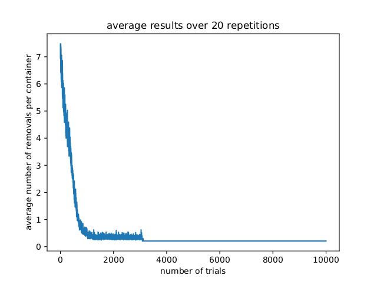

# Container removal algorithm

The goal is to implement an algorithm for loading containers on a ship. The algorithm is defined in the paper "A Q-learning for Group-Based Plan of Container Transfer Scheduling" by Hirashim et al., **JSME International Journal Series C**, Vol. 49, No. 2, 2006.

As the name suggests, the algorithm is based on the reinforcement-learning technique known as Q-learning. It consists in defining three main parts: 1. The state of the system; each possible state is associated with its own different set of actions. 2. A reward and a quality value (Q-value) for every action-state pair. 3. A policy, that is, an algorithm to choose actions given the state of the system.

I found their implementation of the algorithm to be a little chaotic, especially in the part where they treat differently the containers to be transferred to the ship from the ones to be momentarily removed, as well as the part in which they define two Q-values and update them separately.
Therefore, I have made a few little modifications that simplify the implementation without impacting the results.

### Modifications to the algorithm
First of all, I noticed that the desired configuration on the ship can always be renamed to have containers ordered row-wise from bottom left to top right. I have thus imposed always this desired configuration, reducing the complexity of the problem.

Then I decided to consider, as an action, the entire process "move container *c* to stack *s*". As a consequence, every state has a maximum of N * (B * S + 1) associated actions, where N is the number of containers, B the bays, S the stacks per bay, and 1 is given by moving the container to the ship. Using the same parameters as the paper, every state can be associated to up to 36 * (2 * 6 + 1) = 468 actions but some of them will be forbidden (for example, place a container on top of a full stack, or transfer it to the ship if its place is not available.)

As a consequence, I have also had to change the reward. Now, every movement to the ship is rewarded with a big positive number, while every step that does not lead to a new container on the ship gets a negative small reward. Originally in the paper, the reward was only given at the last step, when the configuration reaches the desired buffer: this causes the back-propagation of the rewards to be extremely slow, unless we use eligibility stacks that are powerful but very costly to update. We therefore use intermediate positive rewards for putting stacks in the ship. The negative rewards help avoid useless cycles of removals before transferring the container to the ship.

Finally, the Q-values of container transferral to the ship are initialized to 1 because that's a closer approximation to their real value under our reward assumptions. This speeds up the learning process considerably.

Notice that we suggest the algorithm to transfer the containers immediately but we don't force it: given a large enough amount of memory and time, it could learn alternative solutions, maybe delaying a transferral in order to leave a space available on the ship.

### Analysis of the results

*A random agent takes roughly 27 actions per container, not represented here.*

Around 3000 trials in, the algorithm chooses what is the best way for it and goes on with it. Analysing the steps it takes one sees that something better can be achieved. For example, the last container is moved around a couple of times before being put on the ship. In general, it happens that a container is moved twice in a row, which is clearly useless from the conceptual point of view. More work is necessary to prevent this from happening. I have some ideas and I would be glad to discuss them with you when we will meet.

However, the learning curve is obvious and the results much better than the ones provided by a random policy that chooses amongst all available moves with equal probability.

### Possible improvements
The main problem of this algorithm is the amount of memory that is needed to store the Q-values.
To reduce that, one can work in two directions:
1. Reduce the total number of representations of the system by creating some equivalence class of the states.
2. Reduce the amount of information stored per each state.

The first one is based on the fact that, since the order of containers in each row is irrelevant, we can consider containers not individually but as part of a group. For example, in the example of the paper, 6 containers per row. Remember that we named the six containers in the first row c0, c1, c2, c3, c4, and c5. Well, for our problem, all these containers are equivalent to each other. Therefore, all states that differ by a permutation of these 6 containers are actually the same state. Integrating this idea in the code is not trivial, but it decreases the state space enormously, by a quantity `pow(factorial(S), C)` that in our case corresponds to 139 314 069 504 000 000, roughly 10^17.

Concerning the second one, to speed up the coding, I have stored the Q-value of all actions, even forbidden ones. The Q-value of a forbidden action is simply set to -inf, so that under a softmax policy the probability of taking that particular action is exactly zero. It is possible to change the data structures and store only information about possible actions. In our current example, this would save more than 67 % of space because only at most 12 containers out of 36 are available for any action. While this reduction can look negligible if compared to the previous one, it still matters a lot because this is certain and applies no matter what state we explore.

Once these implementations are done, one could think of running the algorithm on random configurations and learn a global rule for it. Otherwise one should learn a new model for any new configuration (it is anyway fast, around 5 minutes for 10 000 episodes on my machine.)

Another, completely different question is the policy. I adapted to the softmax policy described in the paper. However, the temperature hyper-parameter should be optimized upon, and one could even think of using a completely different policy altogether, for example, a decaying epsilon-greedy one. More advanced techniques like actor-critic algorithms learn the best policy in real time, together with the Q-values.

### The code
The code is sparsely commented. Effort has been made to make it not too obscure. I am always available to explain the details of the implementations.

I just want to spend a few words on a particular line:
`q_table[(np.ones(N_CONTAINERS, dtype=int) * (-1)).tostring()] = np.ones((N_CONTAINERS, TOTAL_STACKS)) * 10` 
Without this line, the last step in the Q-value update would back-propagate a negative infinity. This is because, with the formalism that we have implemented, no actions are allowed from the terminal state, which will therefore get a Q-value of -inf for all actions. The last update of the Q-learning function would thus introduce a bug.
By defining an arbitrary, a priori, high Q-value for all actions in the terminal state, we prevent this problem and also give a sort of an additional reward to actions leading to the terminal state.
